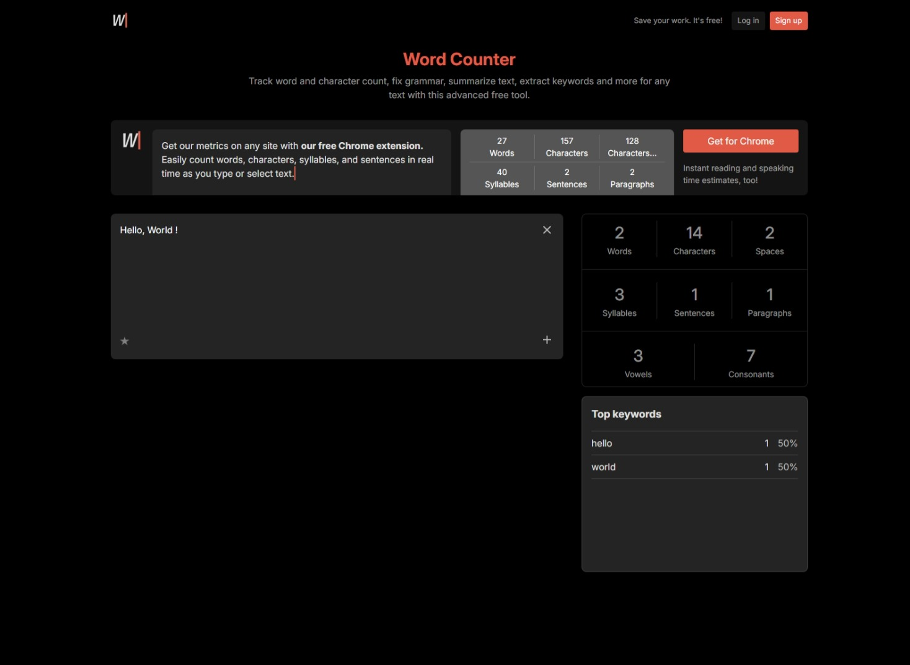

# 🔍 Keyword Extractor

A simple and elegant web app that extracts and displays the most used keywords from a block of text or a given URL.

## ✨ Features

- 🧠 Extracts top keywords with frequency and percentage
- 🎯 Supports raw text or webpage URLs
- 📱 Responsive UI built with TailwindCSS
- ➡️ Pagination system to navigate large lists
- ⚛️ Built using React + TypeScript

## 🚀 Demo



## 🛠️ Tech Stack

- React
- TypeScript
- TailwindCSS
- Vite

## 📦 Installation

```bash
git clone https://github.com/your-username/keyword-extractor.git
cd keyword-extractor
npm install
npm run dev
```
